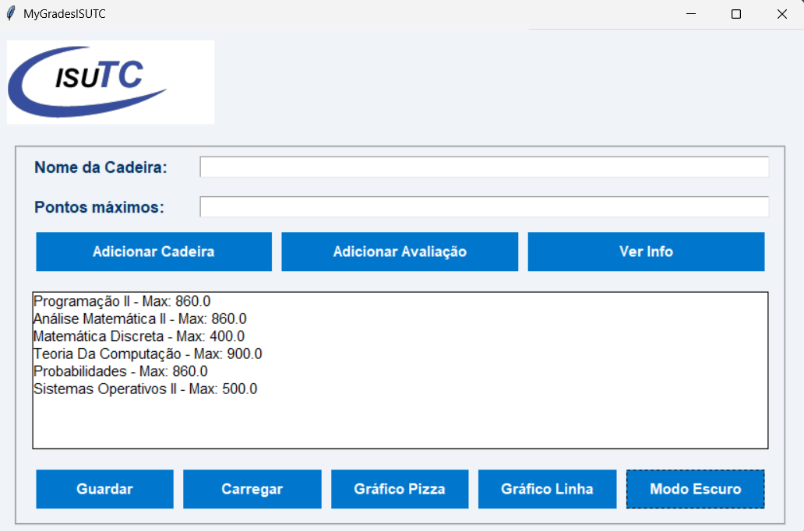

# 🎓 MyGradesISUTC 

Este é um aplicativo desktop criado com Python e Tkinter que permite aos estudantes  registarem as suas cadeiras, inserirem notas das avaliações e verificarem automaticamente se já atingiram a nota mínima para obter 50% da provisória máxima .

## 📌 Funcionalidades

- ✅ Adicionar cadeiras com sua pontuação máxima  
- ✏️ Inserir avaliações (Tipo e pontuação) 
- 📊 Calcular média provisória
- 🔍 Verificar se atingiste a provisória mínima 
- 📈 Visualização gráfica do desempenho  
- 💾 Armazenamento local em ficheiro `.json`

## 🖼️ Interface

A interface é intuitiva, com botões . Tudo foi pensado para facilitar a usabilidade para qualquer estudante.

## 🚀 Como executar

1. Certifica-te de ter o Python instalado  
2. Clona o repositórioo
```bash
git clone https://github.com/seu-usuario/MyGradesISUTC.git
cd MyGradesISUTC/src
pip install -r requirements.txt
cd src/views
python main.py
````
## 📸 Capturas de Tela

Interface principal do MyGradesISUTC, onde podes gerir as cadeiras, adicionar avaliações e visualizar gráficos de desempenho.



## 🤝 Contribuição

Contribuições são bem-vindas! Por favor, envie um pull request com suas melhorias.  

## 📄 Licença

Este projeto está licenciado sob a licença MIT. 


